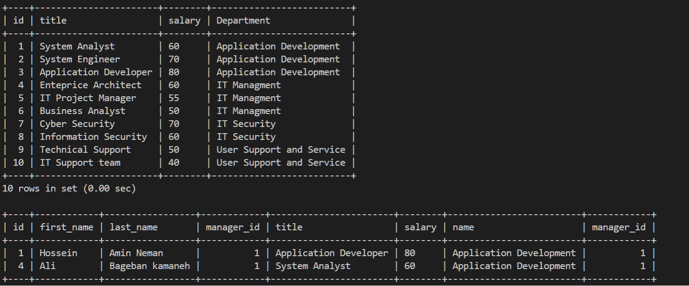
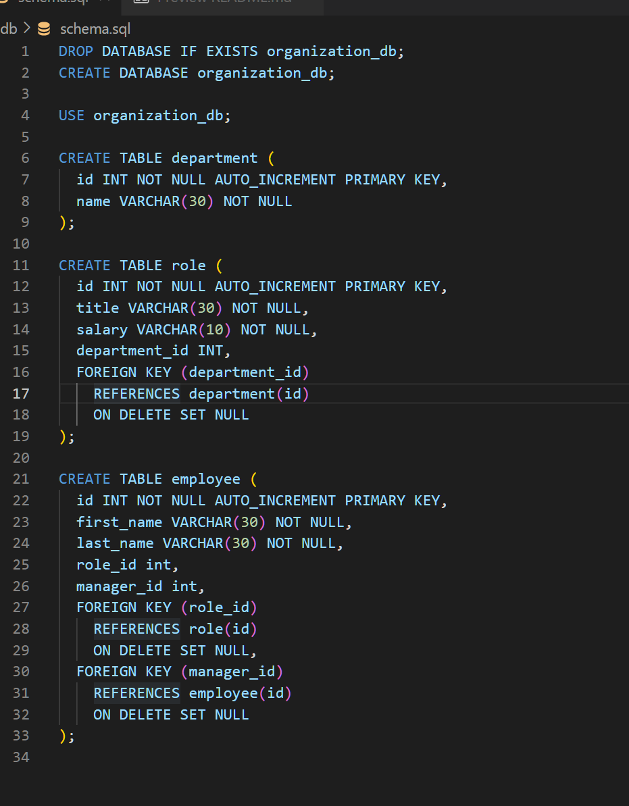
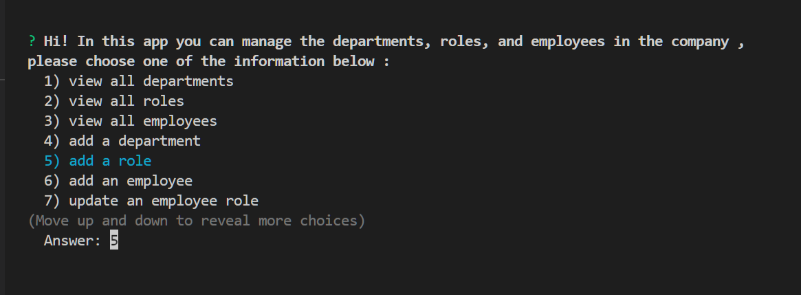
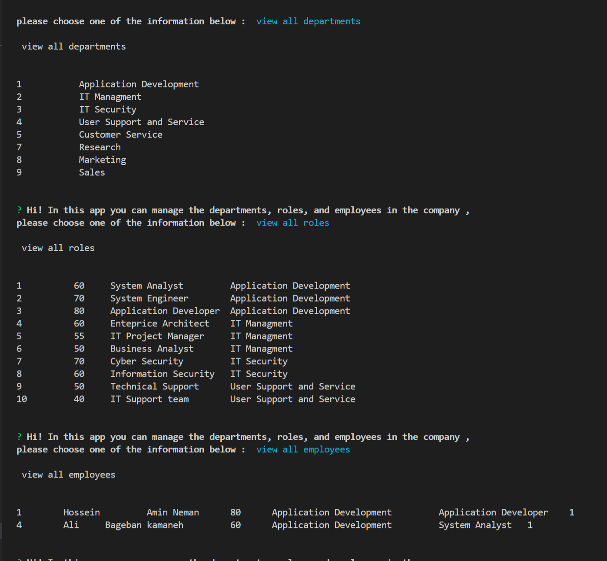

# Employee Tracker

## Description 
This app is a command-line application to manage a company's employee database, using Node.js, Inquirer, and MySQL.

## demo
https://drive.google.com/file/d/1e3tyu-TBdrGeA_v3-eXP47D13oDWWfnL/view

## github link 
https://github.com/neiman924
https://github.com/neiman924/Employee-Tracker

## Table of Contents

- [Installation](#installation)
- [Usage](#usage)
- [Credits](#credits)
- [License](#license)
- [Tests](#tests)
- [Questions](#questions)

## installation
npm i

## usage
AS A business owner user WANT to be able to view and manage the departments, roles, and employees in the company, SO THAT they can organize and plan the business
    ## screenshot
    
    
    
    
 
## credits
none

## license

# none
# none

## tests

## questions
- Please send me email if you had any questions, my email address is :
 neiman924@gmail.com

